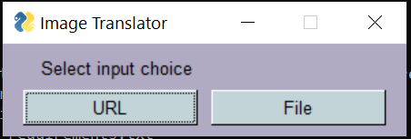
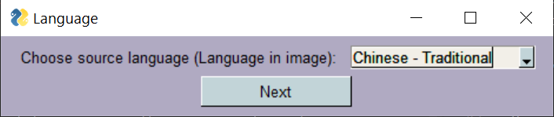
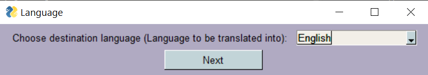
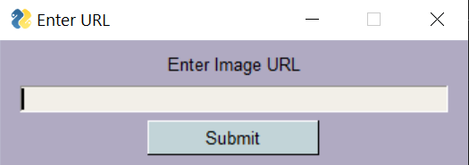
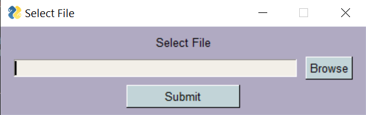
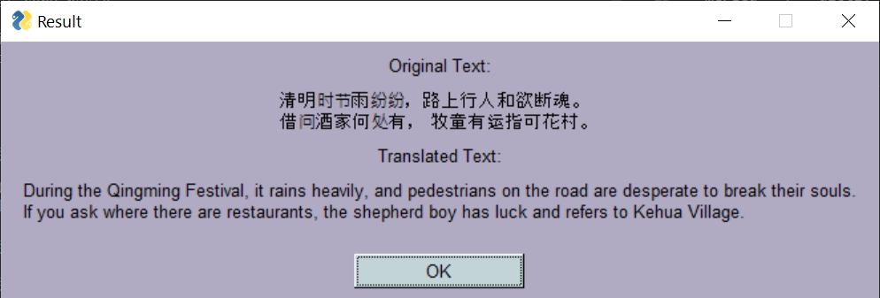

# silver-telegram
A simple Python GUI Application which reads text from an image (of any language) and translates it into the language of the user's choosing.

## How to run

For installation of required packages, run:

```sh
pip install -r requirements.txt
```

Run main.py in your terminal:

```sh
python main.py
```

## What is silver-telegram?

We see images with text in languages we do not know all over the internet. If it were in text format, we could have copied the text and used Google Translate. But that is not the case for images. We cannot just copy-paste.

This application reads text from an image the user provides and gives an output of the text translated to a language of the user's choosing.

The image can be given as a URL or from the user's system.



The user then chooses the source and destination language from a dropdown list.





The user enters the image URL or selects the file from the system.





The output is shown in the next screen with the original and translated texts.

### Input Image


### Output
